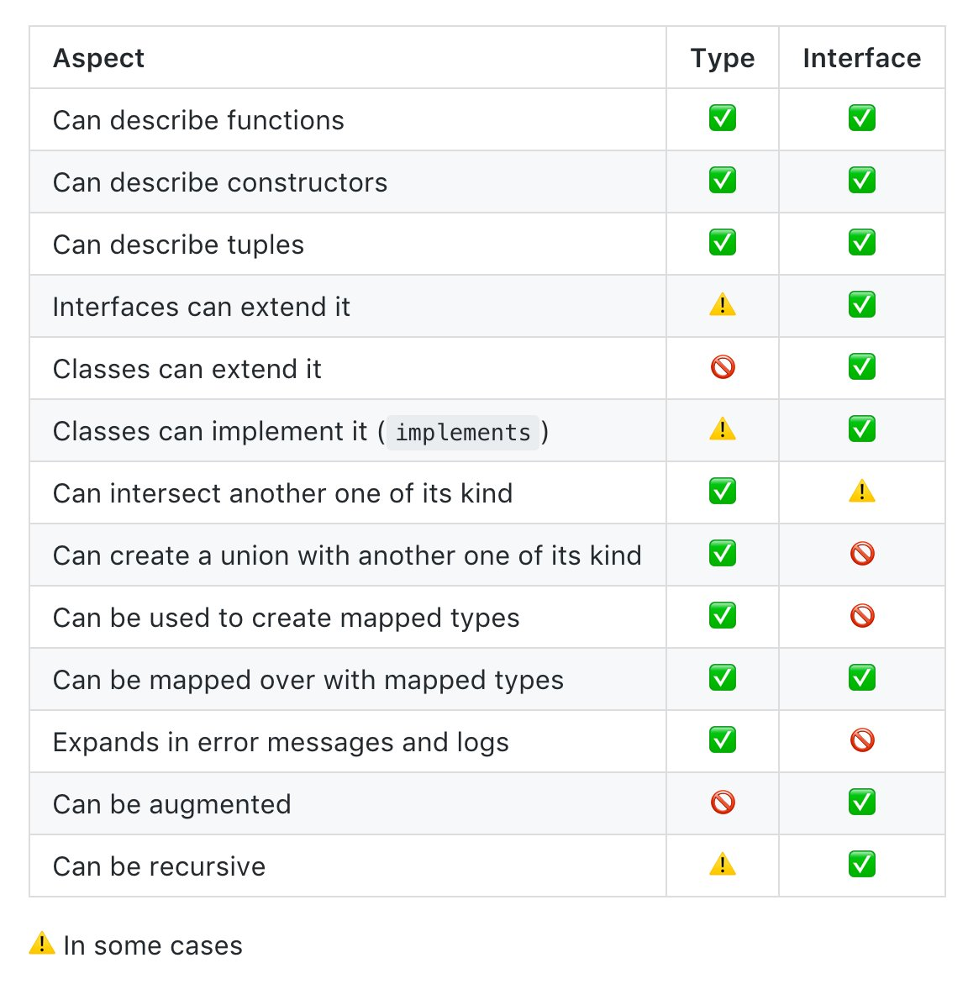

타입스크립트를 사용하기 시작한 뒤로 type을 기술할 때, 일반적인 상황에서는 특별한 고민 없이 interface를 사용하고 있었다. TypeScript 공식 문서에서 특별한 상황이 아니라면 interface의 사용을 권장하고 있기 때문이다. 최근 타입스크립트는 빠른 주기로 릴리즈가 되고 있기 때문에 문서가 업데이트되지 않아 현재의 동작을 제대로 설명하지 못하고 있다는 내용의 글을 보았는데 정말 그런지 살펴보았다. 이후의 내용은 2019년 2월 현재 시점의 TypeScript 3.3에서 확인한 내용이다.

## Interface와 Type에 관한 공식 문서들

TypeScript 자체는 빠르게 릴리즈되고 있는데 문서화의 속도가 따라오지 못하는 것으로 보인다. Typescript 3.0부터 등장한 `unknown` type의 경우에도 [What's new in TypeScript · Microsoft/TypeScript Wiki · GitHub](https://github.com/Microsoft/TypeScript/wiki/What's-new-in-TypeScript#typescript-30) 나 [TypeScript \| Announcing TypeScript 3.0](https://blogs.msdn.microsoft.com/typescript/2018/07/30/announcing-typescript-3-0/)에서 확인할 수 있지만 TypeScript를 새롭게 배우고자 하는 사람들이 주로 정보를 확인하는 스펙 문서나 TypeScript Handbook에서는 관련 내용을 찾아보기 힘들다. 기존 사용자라 할지라도 새로운 버전이 릴리즈 될 때마다 변경 사항에 관한 문서를 꼼꼼하게 챙겨보지 않으면 최신 버전의 TypeScript의 변경 점에 대해 알지 못할 수도 있다. 문서와 코드 사이의 거리가 벌어지고 있다는 점은 좋지 않은 신호이지만, 다르게 생각한다면 현재의 TypeScript 프로젝트는 문서화에 많은 도움이 필요하다는 것이고, 개인 개발자에게는 TypeScript 레포지토리에 Contribute 할 좋은 기회일지도 모른다.

### [TypeScript Language Specification 의 Type Aliases section](https://github.com/Microsoft/TypeScript/blob/f30e8a284ac479a96ac660c94084ce5170543cc4/doc/spec.md#3.10)

문서 맨 위에 Version 1.8, January, 2016으로 버전과 날짜가 명시되어 있고 이후의 커밋 기록은 오타를 수정한 것 정도이다.

> Interface types have many similarities to type aliases for object type literals, but since interface types offer more capabilities they are generally preferred to type aliases.
>
> - An interface can be named in an extends or implements clause, but a type alias for an object type literal cannot.
> - An interface can have multiple merged declarations, but a type alias for an object type literal cannot.

> `interface` 타입과 객체 자체에 대한 `type` 별칭은 많은 점이 비슷하지만, `type` 별칭보다 더 많은 것을 할 수 있기에 `interface`를 사용하는 것을 일반적으로 권장합니다.
>
> - `interface`는 `extends`와 `implements` 구문에 사용될 수 있지만, 객체 자체에 대한 `type` 별칭은 그럴 수 없습니다.

- _현재 시점에서는 변경되었으며 `type` 정의 안에 `union`이 사용된 경우를 제외하고 `extends`, `implements` 모두 `interface`와 같이 동작한다._

> - `interface`는 여러 번 선언해도 병합(declaration merging)될 수 있지만, 객체 자체에 대한 `type` 별칭은 그럴 수 없습니다.

- _현재 시점에서도 마찬가지로 `type` 별칭은 선언 병합(declaration merging)을 할 수 없다._

### [TypeScript Handbook의 Type Aliases section](https://github.com/Microsoft/TypeScript-Handbook/blob/f728031b7ab1cf54934c86dc41dbf8774369f866/pages/Advanced%20Types.md#type-aliases)

추가되거나 변경된 내용이 반영되고는 있지만, 여전히 최신 TypeScript의 내용을 잘 따라가고 있지 못하다.

> #### [Interfaces vs. Type Aliases](https://github.com/Microsoft/TypeScript-Handbook/blob/f728031b7ab1cf54934c86dc41dbf8774369f866/pages/Advanced%20Types.md#interfaces-vs-type-aliases)
>
> As we mentioned, type aliases can act sort of like interfaces; however, there are some subtle differences.
>
> One difference is that interfaces create a new name that is used everywhere. Type aliases don’t create a new name — for instance, error messages won’t use the alias name. In the code below, hovering over interfaced in an editor will show that it returns an Interface, but will show that aliased returns object literal type.
>
> ```typescript
> type Alias = { num: number }
> interface Interface {
>   num: number
> }
> declare function aliased(arg: Alias): Alias
> declare function interfaced(arg: Interface): Interface
> ```
>
> A second more important difference is that type aliases cannot be extended or implemented from (nor can they extend/implement other types). Because an ideal property of software is being open to extension, you should always use an interface over a type alias if possible.
>
> On the other hand, if you can’t express some shape with an interface and you need to use a union or tuple type, type aliases are usually the way to go.

> 앞서 언급했듯이, `type` 별칭은 `interface`와 같은 역할을 할 수 있지만 약간의 차이점이 있습니다.
>
> 한 가지 차이점은 `interface`가 어디에서나 사용되는 새 이름을 만든다는 것입니다. `type` 별칭으로는 새 이름을 만들 수 없습니다. 예를 들어 오류 메시지에서는 별칭 이름을 사용하지 않습니다. 아래 코드를 편집기에서 `interfaced` 위로 마우스를 가져가면 `interface`가 표시되는 것을 볼 수 있지만, `aliased`는 객체 자체의 타입으로 표시되는 것을 볼 수 있습니다.

- _현재 시점에서는 위 코드의 `interfaced`와 `aliased` 모두 새로운 이름이 생성된다._

> 두 번째로 중요한 차이점은 `type` 별칭은 `extends`/`implements`에 사용될 수 없고, 이를 사용 할 수도 없다는 점입니다. 소프트웨어의 이상적인 특성은 확장할 수 있도록 열려있는 것이기 때문에 가능한 경우 `type` 별칭 대신 `interface`를 사용해야 합니다.

- _현재 시점에서는 변경되었으며 `type` 정의 안에 `union`이 사용된 경우를 제외하고 `extends`, `implements` 모두 `interface`와 같이 동작한다._

> 반대로, `interface`로는 모양을 표현할 수 없는 경우와 `union` 혹은 `tuple` 타입이 필요한 경우, 보통 `type` 별칭을 사용합니다.

## 참고한 자료들

주로 구글에서 `typescript interface vs type`으로 검색한 내용이다.

### [Interface vs Type alias in TypeScript 2.7 – Martin Hochel – Medium](https://medium.com/@martin_hotell/interface-vs-type-alias-in-typescript-2-7-2a8f1777af4c)

2018년 3월에 쓰였으며 TypeScript 2.7에서의 동작을 설명하고 있고 현재도 유효하다.

> So what’s the difference between type alias and interface again 🤖?
>
> 1. you cannot use implements on an class with type alias if you use union operator within your type definition
> 2. you cannot use extends on an interface with type alias if you use union operator within your type definition
> 3. declaration merging doesn’t work with type alias

> 그렇다면 유형 별칭과 인터페이스의 차이점은 무엇입니까?
>
> 1. 타입 정의 내에서 union 연산자(`|`)를 사용하면 `class`에서 `type` 별칭을 사용하여 `implements` 할 수 없습니다.
> 2. 타입 정의 내에서 union 연산자(`|`)를 사용한다면 `interface`에서 `type` 별칭을 사용하여 `extends`를 사용할 수 없습니다.
> 3. 선언 병합은 `type` 별칭에서 동작하지 않습니다.

### [Typescript: Interfaces vs Types - Stack Overflow](https://stackoverflow.com/questions/37233735/typescript-interfaces-vs-types/52682220#52682220)

[User jabacchetta - Stack Overflow](https://stackoverflow.com/users/4500152/jabacchetta)의 답글로 2019년 1월에 쓰였으며 예제 코드를 중심으로 잘 설명되어 있다.

### [Typescript: Interfaces vs Types - Stack Overflow](https://stackoverflow.com/questions/37233735/typescript-interfaces-vs-types/54101543#54101543)

[User Karol Majewski - Stack Overflow](https://stackoverflow.com/users/10325032/karol-majewski)의 답글에 첨부된 이미지로 TypeScript 3.2의 동작에 관해서 작성된 이미지다.



## 정리

### Interface의 Declaration Merging이 가장 큰 차이이다

- `interface`는 같은 이름으로 여러 번 선언을 해도 컴파일 시점에서 합쳐지기 때문에 확장성이 좋다. 따라서 일반적으로는 `interface`를 사용하고 `union`, `tuple` 등이 필요한 경우에만 `type` 별칭을 사용하라는 TypeScript Handbook의 내용은 현재에도 유효하다.
- `declaration merging`으로 확장할 수 있기 때문에, 외부에 노출해야 하는 public API에 사용되는 타입은 항상 `interface`를 사용하여 작성해야 한다.
- `type` 별칭으로 작성된 타입은 조금 더 제한적이기 때문에 private API같이 외부에 노출할 필요가 없는 경우에 사용하는 것이 좋다.

### React Component의 Props와 State의 타입을 기술하려면 어떤 것이 좋을까?

`interface`와 `type alias`에 대해 알아보기 시작한 이유이다.

- 일반적으로는 `interface`를 사용해도 무리가 없다.
- React component를 사용하는데 `declaration merging`이나 `implements`는 필요 없다.
- `interface`는 union이 사용되었다면 `extends` 할 수 없기 때문에 해당 경우에는 `type` 별칭을 사용해서 타입을 기술해야 한다.
